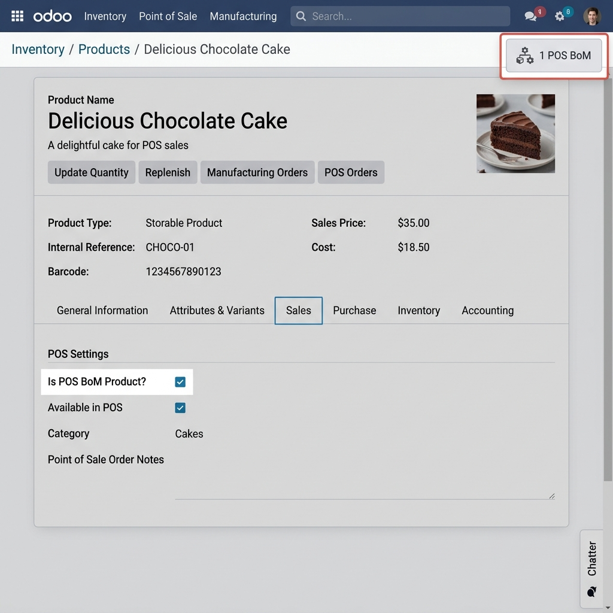
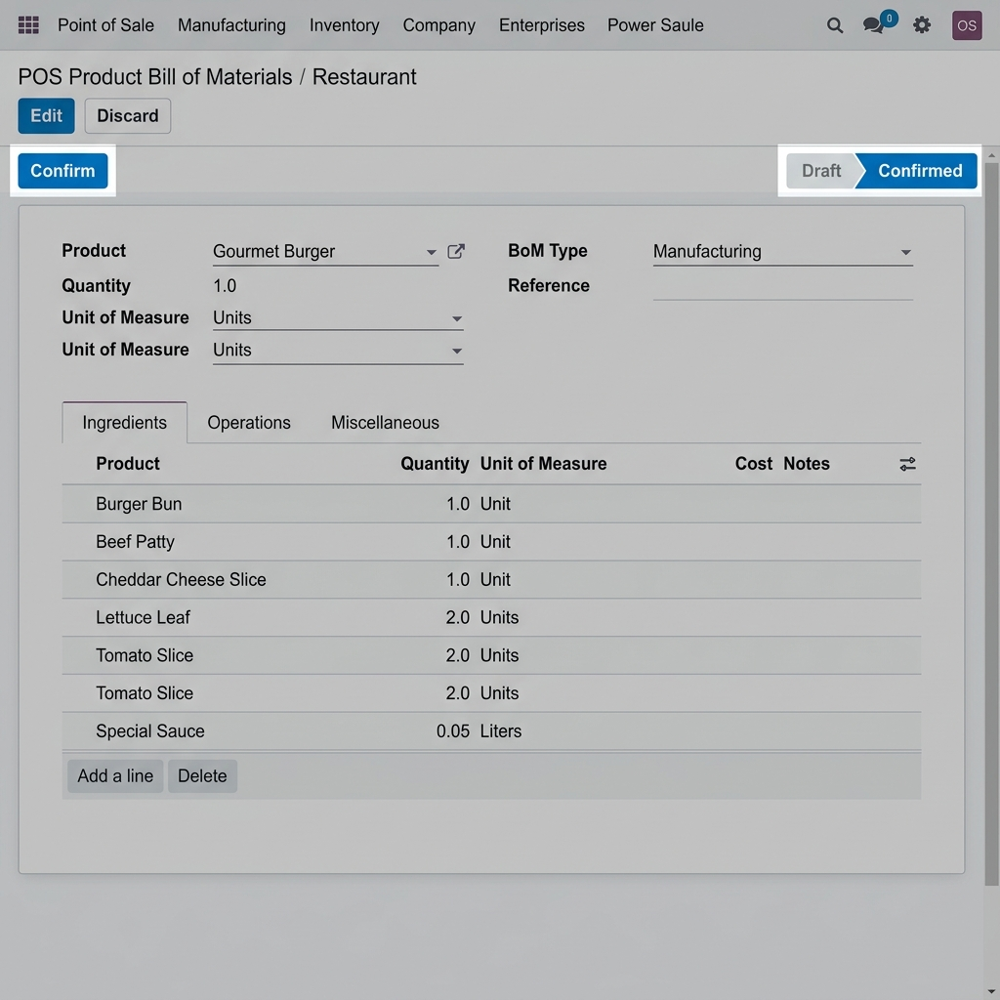

# SLV POS Product BoM

**SLV POS Product BoM** is a custom Odoo 18 addon that introduces a Bill of Materials (BoM) system specifically designed for Point of Sale (POS) restaurant products. 

When a finished food item (e.g., a Burger) is sold in the POS, this module intercepts the standard stock move creation. Instead of deducting the stock for the finished product, it explodes the BoM and deducts the raw ingredients from the stock in real-time or at session closing.

## Features
- Designate any product as a **POS BoM Product**.
- Create multiple Bills of Materials for a single product (only one can be active/confirmed at a time).
- Add raw ingredients with respective quantities and units of measure.
- Automatic unit of measure conversion during stock deduction.
- Fully integrated into standard POS order and stock picking flows for full traceability.

---

## Configuration

1. **Enable POS BoM on a Product**
   - Navigate to **Inventory** > **Products** or **POS** > **Products**.
   - Open a product form (e.g., "Classic Burger").
   - Under the **Point of Sale** tab, check the box **Is POS BoM Product?**.
   - Save the product.

   

2. **Create a POS Bill of Materials**
   - Navigate to **Point of Sale** > **Products** > **POS Products BoM**.
   - Click **New** to create a new BoM.
   - Select the **Product** (only products with *Is POS BoM Product?* checked will appear).
   - Add the **Ingredients** under the BoM Lines tab. Specify the ingredient product, quantity, and unit of measure.
   - Click the **Confirm** button at the top left to activate this BoM. 

   

3. **User Access Rights**
   - **POS BoM Manager**: Can create, edit, confirm, and delete BoM records.
   - **Standard POS Users**: Have read-only access to BoMs.

---

## Usage Example

1. Ensure your ingredients (e.g., Burger Bun, Beef Patty, Lettuce) are properly stocked in your POS warehouse location.
2. Confirm a POS BoM for "Classic Burger" consisting of those ingredients.
3. Open a POS Session and sell a "Classic Burger".
4. Close the POS session or check real-time stock moves.
5. In **Inventory** > **Transfers**, locate the POS picking. You will see that instead of "Classic Burger", the system has successfully picked and deducted "Burger Bun", "Beef Patty", and "Lettuce".

## Technical Constraints
- A product can only have **one confirmed BoM** at any given time. If you need to switch the recipe, you must set the current confirmed BoM back to "Draft" before confirming the new one.
- The module relies on native Odoo `stock.picking` extension to perform "phantom-like" BoM explosions. Ingredient stock moves inherit the original POS order traceability and reference.
